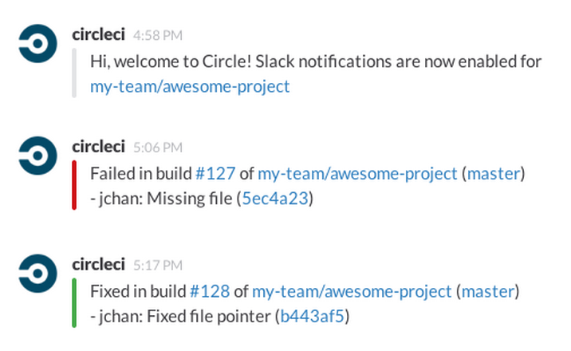
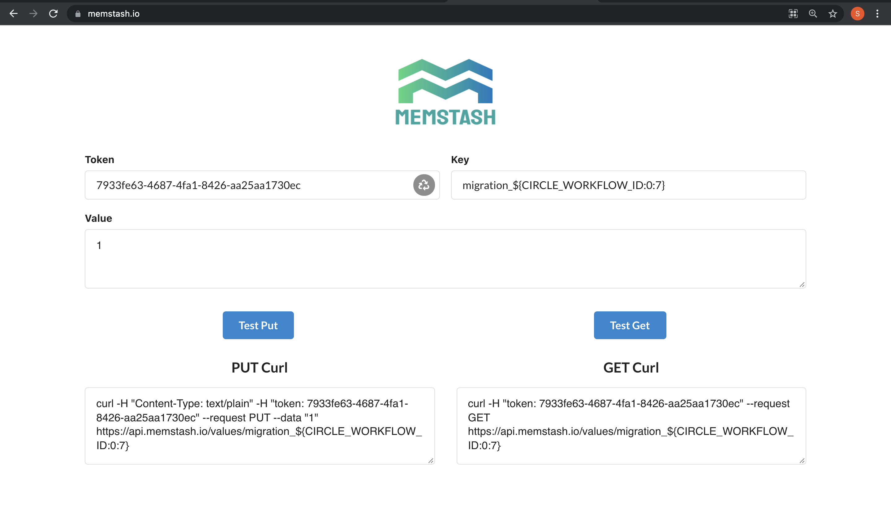
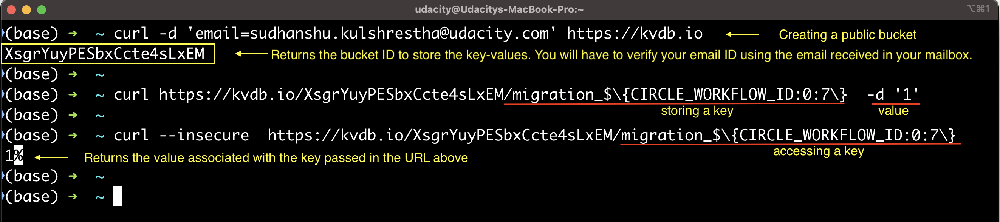
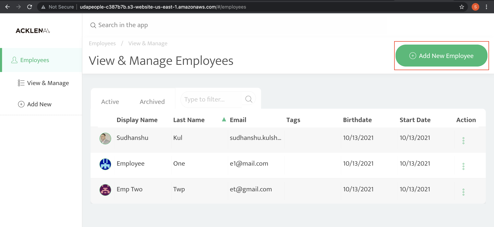
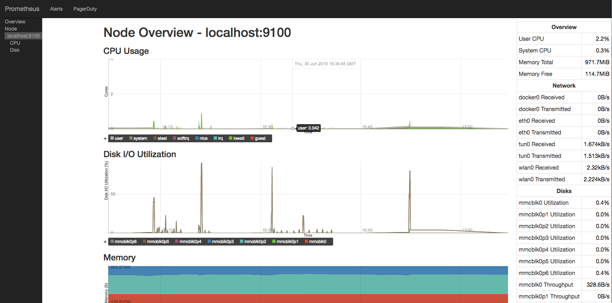
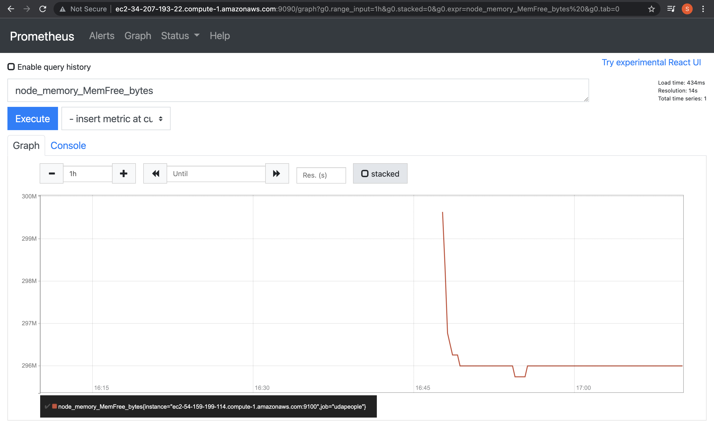
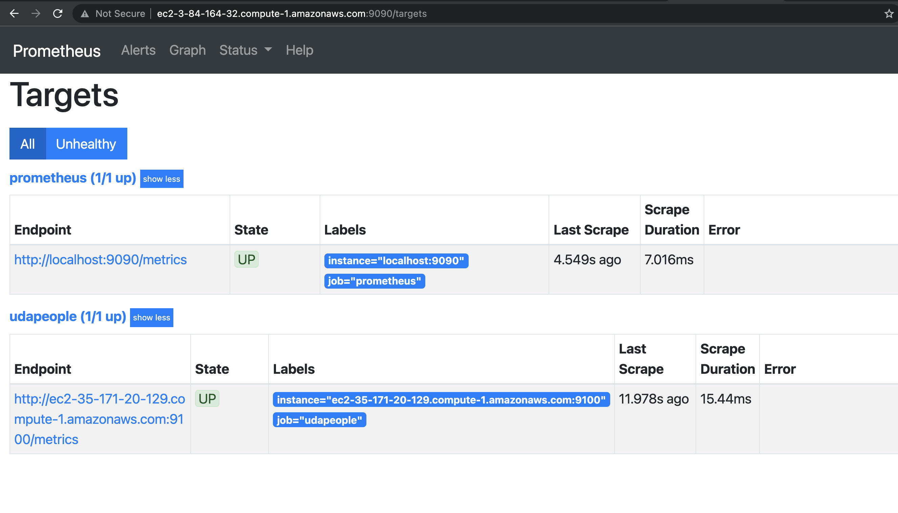
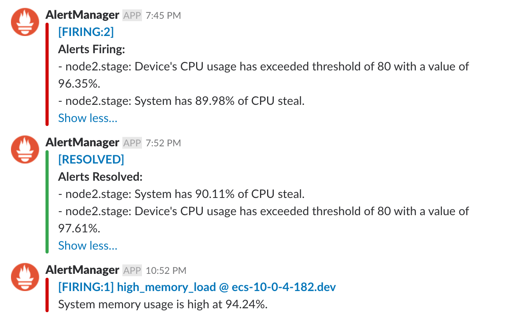

# DevOps-Auto-Deploy


In this project, you will prove your mastery of the following learning objectives:
- Utilize Deployment Strategies to design and build CI/CD pipelines that support Continuous Delivery processes.
- Utilize a configuration management tool to accomplish deployment to cloud-based servers.
- Surface critical server errors for diagnosis using centralized structured logging.

## 1. Directory structure relevant for the project:
``` bash
├── .circleci
│   ├── ansible
│   └── files
├── backend  # Do not run npm commands here (on your local machine). 
│   ├── src
│   └── test
├── frontend # Do not run npm commands here (on your local machine). 
│   ├── src
│   └── types
└── util     # Files relevant for the running the app locally (Optional).
```

### Contents of the .circleci directory:
1. CloudFormation templates - use throughout the deployment phase of this project: <b>cloudfront.yml</b> - use this file to manually create a stack.<b>backend.yml and frontend.yml</b> - CircleCI job will run these files.

2. Ansible Playbooks and Roles - The /.circleci/ansible directory contains the playbook files and roles that you will develop, per instructions on the next page.

3. CircleCI config.yml file

## 2. Run in localhost (optional)
This is a "mono-repository" which means multiple servers or layers exist in the same repository. The following main folders:

- `./frontend`
- `./backend`

### 1. Install dependencies in both `frontend` and `backend` folders.
```bash
cd frontend
npm i
cd backend
npm i
```
### 2. Create `.env` file for database connection info.
Add a `.env` file to `backend` folder with the following contents:
```bash
NODE_ENV=local
VERSION=1
TYPEORM_CONNECTION=postgres
TYPEORM_MIGRATIONS_DIR=./src/migrations
TYPEORM_ENTITIES=./src/modules/domain/**/*.entity.ts
TYPEORM_MIGRATIONS=./src/migrations/*.ts

# Things you can change if you wish...
TYPEORM_HOST=localhost
TYPEORM_PORT=5532
TYPEORM_USERNAME=postgres
TYPEORM_PASSWORD=password
TYPEORM_DATABASE=glee
```
We can use our own Postgres server or we can use the Docker-Compose template for local testing provided in the `./utils` folder. To run this template, we'll need to install Docker and Docker-Compose.
```bash
cd util
docker-compose up
```
### 3. Compiling the Code
```bash
cd frontend
npm run build
cd backend
npm run build
```
### 4. Testing, Migrating, Running
| Name | Purpose | Notes | 
| :-- | :-- | :-- |
| migrations | Checks for any migration scripts that have not yet been applied to the db | Make sure we have a Postgres database running and `.env` file is configured correctly |
| migrations:revert | Revert last successfully executed migration | The same connection configuration is needed here as with the `migrations` script above. |
| test | Run all unit tests | |
| build | Compiles the code | Drops the compiled code in the `./dist` folder. |
| start | Starts up the application locally. | Make sure we have a Postgres database running and `.env` file is configured correctly |
### Examples:
```bash
# compile the code and then list the result in the `./dist` folder
cd frontend
npm run build
cd dist
ls
# revert the last migration
cd backend
npm run migrations:revert
```

## 3. Utilize Deployment Strategies to Design and Build CI/CD Pipelines that Support Continuous Delivery Processes
* [Create an account](https://circleci.com/signup/?source-button=free) with circleci.com.
* Create a new project in Circle CI using your GitHub repo.
* Ensure a workflow starts with the jobs in your `.config` file.
### 1. Build Phase
The goal is to compile or lint the source code to check for syntax errors or unintentional typos in code. It’s your first line of defense against bugs as you attempt to integrate the pieces of your project together.
### 2. Test Phase
Unit tests are one of the many very important building blocks of a system that enables Continuous Delivery (notice, we didn’t say “the only or most important thing”).
### 3. Analyze Phase
It would be a shame if a package with a known vulnerability left a security hole in our application, giving hackers access to that information! That’s why we should include a job that checks for known vulnerabilities every time we check in new code.
### 4. Alerts
That way they can jump in and save the day (the day that they almost ruined by checking in bad code). We’re going to add an alert so that botched builds raise a nice wavy red flag. Integrate Slack, email or another communication tool to receive alerts when jobs fail. Alerts should include a summary of what happened and a link to the job console output for quick troubleshooting.

The steps for configurinig the Slack notification are:
1. Setup Authentication https://github.com/CircleCI-Public/slack-orb/wiki/Setup
2. Integrate Slack orb https://circleci.com/developer/orbs/orb/circleci/slack

## 4. Utilize a Configuration Management Tool to Accomplish Deployment to Cloud-Based Servers
Creating and configuring infrastructure before deploying code to it. Preparing your AWS and CircleCI accounts just a bit, then by building Ansible Playbooks for use in your CircleCI configuration.
### AWS
1. Create and download a new key pair in AWS for CircleCI to use to work with AWS resources. [This tutorial may help](https://docs.aws.amazon.com/AWSEC2/latest/UserGuide/ec2-key-pairs.html#having-ec2-create-your-key-pair) 
2. Add a PostgreSQL database in RDS that has **public accessibility**. [This tutorial may help.](https://aws.amazon.com/getting-started/tutorials/create-connect-postgresql-db/)
```
Endpoint (Hostname): database-1.ch4a9dhlinpw.us-east-1.rds.amazonaws.com 
Instance identifier: database-1 //This is not the database name
Database name: postgres (default)
Username: postgres
Password: mypassword
Port: 5432
```
### CloudFront Distribution Primer
1) Create an S3 Bucket.
2) Run [Cloud Formation](.circleci/files/cloudfront.yml) template locally
```
cd .circleci/files
aws cloudformation deploy \
    --template-file cloudfront.yml \
    --stack-name InitialStackCloudfront\
    --parameter-overrides WorkflowID=devops-kk1j287dhjppmz437
```
Upon successful execution, the cloudfront.yml template file will create a CloudFront Distribution connected to your existing S3 bucket, and a CloudFrontOriginAccessIdentity.
### Circle CI
1. Add SSH Key pair from EC2 as shown [here](https://circleci.com/docs/2.0/add-ssh-key/). To get the actual key pair, we'll need to open the pem file in a text editor and copy the contents. Then you can paste them into Circle CI.
2. Add the following environment variables to your Circle CI project by navigating to {project name} > Settings > Environment Variables as shown [here](https://circleci.com/docs/2.0/settings/):
  - `AWS_ACCESS_KEY_ID`=(from IAM user with programmatic access)
  - `AWS_SECRET_ACCESS_KEY`= (from IAM user with programmatic access)
  - `AWS_DEFAULT_REGION`=(your default region in aws)
  - `TYPEORM_CONNECTION`=`postgres`
  - `TYPEORM_MIGRATIONS_DIR`=`./src/migrations`
  - `TYPEORM_ENTITIES`=`./src/modules/domain/**/*.entity.ts`
  - `TYPEORM_MIGRATIONS`=`./src/migrations/*.ts`
  - `TYPEORM_HOST`={your postgres database hostname in RDS}
  - `TYPEORM_PORT`=`5532` (or the port from RDS if it’s different)
  - `TYPEORM_USERNAME`={your postgres database username in RDS}
  - `TYPEORM_PASSWORD`={your postgres database password in RDS}
  - `TYPEORM_DATABASE`={your postgres database name in RDS}

_NOTE:_ Some AWS-related jobs may take awhile to complete. If a job takes too long, it could cause a timeout. If this is the case, just restart the job and keep your fingers crossed for faster network traffic. If this happens often, you might consider increasing the job timeout [as described here](https://support.circleci.com/hc/en-us/articles/360007188574-Build-has-hit-timeout-limit).
### 1. Infrastructure Phase
Add CircleCI jobs that execute Cloud Formation templates (frontend.yml & backend.yml) that create infrastructure as well as jobs that execute Ansible Playbooks (inventory.txt) to configure that newly created infrastructure.
#### Create/Deploy Infrastructure
* Fix: You will have to change the AMI ID and KeyPair name in the backend.yml file, as applicable to your AWS account/region, before you push your changes to Github.
#### Configure Infrastructure
- Install and [Configure PM2](https://www.digitalocean.com/community/tutorials/how-to-use-pm2-to-setup-a-node-js-production-environment-on-an-ubuntu-vps) to run back-end server.
### 2. Deploy Phase
#### Database migrations
Alternatively, it's alright to use any other key-value storage service. Generate the PUT/GET URLS using the Key in Memstash.io

Recall the steps to create a KVdb.io bucket, and setting up a key-value, and later get the value associated with a particular key. 

#### Deploy Front-end
- Add the url of the newly created back-end server to the `API_URL` environment variable. This is important to be done before building the front-end in the next step because the build process will take the `API_URL` from the environment and "bake it" (hard-code it) into the front-end code.
- In a previous job, you created the back-end infrastructure and saved the IP address of the new EC2 instance. This is the IP address you will want to pull out and use here. If the IP address is "1.2.3.4", then the `API_URL` should be `https://1.2.3.4:3000`.
#### Deploy Back-end
### 3. Smoke Test Phase
- Test the back-end:
  - Retrieve the back-end IP address that you saved in an earlier job.
  - Use `curl` to hit the back-end API's status endpoint (e.g. https://1.2.3.4:3000/api/status)
  - No errors mean a successful test
- Test the front-end:
  - Form the front-end url using the workflow id and your AWS region like this: `URL="http://devops-${CIRCLE_WORKFLOW_ID}.s3-website-us-east-1.amazonaws.com"` 
  - Check the front-end to make sure it includes a word or two that proves it is working properly.
  - No errors mean a successful test
### 4. Rollback Phase
- Create a “[command](https://circleci.com/docs/2.0/reusing-config/#authoring-reusable-commands)” named `destroy-environment` to remove infrastructure if something goes wrong
  - Trigger rollback jobs if the smoke tests or any following jobs fail. 
  - Delete files uploaded to S3.
  - Destroy the current CloudFormation stacks using the same stack names you used when creating the stack earlier (front-end and back-end).
- Create a “[command](https://circleci.com/docs/2.0/reusing-config/#authoring-reusable-commands)” named `revert-migrations` to roll back any migrations that were successfully applied during this CI/CD workflow
  - Trigger rollback jobs if the smoke tests or any following jobs fail. 
  - Revert the last migration (IF a new migration was applied) on the database to that it goes back to the way it was before. You can use that value you saved in [MemStash.io](https://memstash.io) to know if you should revert any migrations.

## 5. Promotion Phase
Assuming the smoke test came back clean, we should have a relatively high level of confidence that our deployment was a 99% success. Now’s time for the last 1%. We uses the “Blue-Green Deployment Strategy” which means we deployed a second environment or stack next to our existing production stack. Now that we’re sure everything is "A-okay", we can switch from blue to green. 

## 6. Cleanup Phase
Adding a job to clean up old stacks.
- Remove old stacks/files
  - Back-end stack (example: `aws cloudformation delete-stack --stack-name "devops-backend-${OldWorkflowID}"`)
  - Front-end files in S3 (example: `aws s3 rm "s3://devops-${OldWorkflowID}" --recursive`)

## 7. Run the application
Try accessing the application using either the CloudFront domain name or the public URL for your S3 Bucket.


## 8. Surface Critical Server Errors for Diagnosis Using Centralized Logging
If a server has an error in a forest, but no one is there to hear it, did it actually happen? Why is the server in the forest in the first place? We chose Prometheus as a monitoring solution since it is open-source and versatile. Once configured properly, Prometheus will turn our server’s errors into sirens that no one can ignore.  
### Setup
- Set up Prometheus Server on EC2 following [these instructions](https://codewizardly.com/prometheus-on-aws-ec2-part1/).
- Configure Prometheus for AWS Service Discovery following [these instructions](https://codewizardly.com/prometheus-on-aws-ec2-part3/).
### 1. Setup Back-End Monitoring
In order for server instances to speak to Prometheus, we need to install an “exporter” in each one. Create a job that uses Ansible to go into the EC2 instance and install the exporter.
- Add a section to your back-end configuration job to install the `node_exporter` for Prometheus monitoring. Playbook can simulate the steps in [this tutorial](https://codewizardly.com/prometheus-on-aws-ec2-part2/). 







Tip: When you see error like: err="opening storage failed: lock DB directory: resource temporarily unavailable", you can consider restarting the Prometheus server.
### 2. Setup Alerts
Receive an alert in chat when the server starts running out of memory or disk space. Set up a job to make that dream a reality.
- SSH into your Prometheus Server.
- Install and configure AlertManager by following [these instructions](https://codewizardly.com/prometheus-on-aws-ec2-part4/).


## Built With

- [Circle CI](www.circleci.com) - Cloud-based CI/CD service
- [CloudFormation](https://aws.amazon.com/cloudformation/) - Infrastrcuture as code
- [Ansible](https://www.ansible.com/) - Configuration management tool
- [Prometheus](https://prometheus.io/) - Monitoring tool